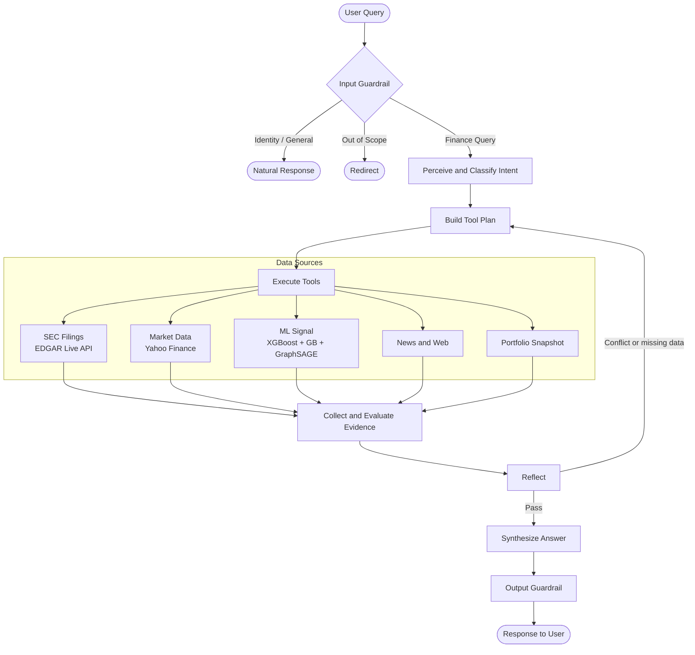

# RAPHI

RAPHI is an agentic AI for financial research.

It takes a question, plans which data sources to query, collects evidence across SEC filings, market data, and ML signals, evaluates whether the evidence is sufficient, and returns a cited, grounded response. It runs locally — no third-party cloud required for data retrieval.

---

## Workflow



---

## Components

| Component | File | What It Does |
|---|---|---|
| API Server | `backend/raphi_server.py` | FastAPI + A2A server on port 9999. Entry point for all queries and the chat UI. |
| MCP Tool Server | `backend/raphi_mcp_server.py` | Exposes RAPHI's tools via Model Context Protocol for external agent use. |
| Agent Loop | `raphi/orchestrators/agent_loop.py` | Orchestrates the full pipeline — perceive, plan, execute, reflect, answer. |
| Planner | `raphi/orchestrators/planner.py` | Classifies intent, extracts tickers, builds the tool execution plan. |
| Tool Executor | `raphi/orchestrators/tool_executor.py` | Runs each tool step with per-tool timeouts and Firecrawl fallback chain. |
| Reflector | `raphi/orchestrators/reflector.py` | Checks whether results are sufficient. Detects signal conflicts and missing provenance. |
| Research Workflow | `raphi/workflows/research_workflow.py` | End-to-end pipeline: plan, execute, reflect, evidence collection, recommendation governance. |
| Trending Workflow | `raphi/workflows/trending_stocks_workflow.py` | Discovers trending tickers from live market screeners. No hardcoded defaults. |
| SEC Data | `backend/sec_data.py` | Local SEC EDGAR database — 9,460+ companies, 16 quarters (2022 Q1 – 2025 Q4). |
| EDGAR Live | `backend/edgar_live.py` | Live EDGAR API — real-time filings, 8-K events, Form 4 insider transactions. |
| Market Data | `backend/market_data.py` | Live market quotes, fundamentals, and news via Yahoo Finance. |
| GNN Signal Engine | `backend/gnn_model.py` | GraphSAGE peer-influence model. Graph-neighbor signals using 2-layer SAGEConv. |
| Filing Classifier | `backend/filing_classifier.py` | Fine-tuned Qwen2.5 classifier: BUY / SELL / HOLD signal from SEC filing text. Falls back to Claude Haiku before local model is trained. |
| Guardrails | `backend/llm_guardrails.py` | Post-generation safety layer. Softens overconfident language, enforces risk framing, validates memo schema. |
| Graph Memory | `backend/graph_memory.py` | Durable memory store. Persists research context and interaction history across sessions. |
| Knowledge Graph | `backend/knowledge_graph.py` | Neo4j graph of companies, sectors, peers, and GNN-derived correlations. |
| Eval Harness | `backend/eval_harness.py` | Automated evaluation of response quality — citation presence, signal coverage, honesty checks. |

---

## How It Works

A query enters the system and is immediately classified into one of three categories: a general or identity question, a finance query, or something out of scope. Only finance queries proceed into the research pipeline.

For a finance query, the planner extracts tickers and classifies intent — SEC research, company analysis, model signal, portfolio risk, investment memo, or recommendation. Based on intent, it builds a specific set of tool steps.

Tools execute against live data sources. SEC filings come from the EDGAR API first, falling back to the local bulk database. Market data, news, and ML signals are fetched in parallel. The ML signal combines XGBoost and Gradient Boosting predictions with GraphSAGE peer-influence scores when the GNN model is trained.

Once results are collected, the reflector evaluates them. If a required tool failed, or if the price model and the filing classifier disagree on direction, the system marks the result as retryable and adjusts the plan — skipping failed steps, adding targeted follow-up calls — before re-running. This loop is bounded to a maximum of two attempts.

Evidence packets are assembled with freshness checks and citation links. For recommendation queries, a governance layer always downgrades to research-only output until a proper approval gate is configured.

The final response passes through the output guardrail before reaching the user.

---

## How to Run

**Requirements:** Python 3.11+

```bash
# 1. Create and activate a virtual environment
python3 -m venv .venv
source .venv/bin/activate        # Windows: .venv\Scripts\activate

# 2. Install dependencies
pip install -r backend/requirements.txt

# 3. Set environment variables
cp .env.example .env
# Edit .env and add:
#   RAPHI_API_KEY=your-local-api-key
#   ANTHROPIC_API_KEY=your-anthropic-api-key
```

```bash
# 4. Start the server
python backend/raphi_server.py
```

```bash
# 5. Open the UI
# http://localhost:9999
```

```bash
# 6. Run the test suite
pytest -q
```

The server runs on `127.0.0.1:9999`. The chat UI, REST API, and A2A agent endpoint are all served from the same process.

---

## What RAPHI Does Not Do

- **Does not execute trades.** RAPHI has no connection to any brokerage, exchange, or order management system.
- **Does not provide regulated financial advice.** Outputs are research context. They are not investment recommendations under any securities regulation.
- **Does not guarantee data accuracy.** Market data and SEC filings are retrieved from external sources. Verify independently before acting on any output.
- **Model signals are not trade instructions.** XGBoost, Gradient Boosting, and GraphSAGE signals are probabilistic research context — not entry or exit signals for live trading.
- **The full agentic loop is in active development.** The ReAct orchestration loop — where an LLM drives the plan, execute, and reflect steps through tool-use reasoning — is being built. Current research queries use rule-based orchestration with a direct Claude synthesis call.
- **The local filing classifier requires training.** The fine-tuned Qwen2.5 model needs to complete the training run on GPU before it replaces the Claude Haiku fallback.

---

## License

Apache License 2.0 — see [LICENSE](LICENSE) for full terms.

Copyright 2026 alankit04
